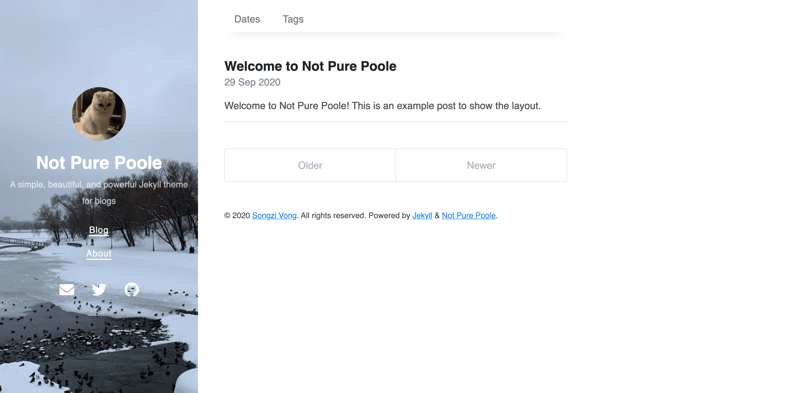

#### 生成网站图标

[**Chirpy**](https://github.com/cotes2020/jekyll-theme-chirpy/) 的 [图标](https://www.favicon-generator.org/about/)放在目录中。您可能希望用自己的替换它们。以下部分将指导您创建和替换默认网站图标。`assets/img/favicons/`

#### 生成网站图标

准备一张大小为 512x512 或更大的方形图像（PNG、JPG 或 SVG），然后转到在线工具 [**Real Favicon Generator**](https://realfavicongenerator.net/) 并单击按钮上传您的图像文件。Select your Favicon image

在下一步中，网页将显示所有使用场景。您可以保留默认选项，滚动到页面底部，然后单击按钮以生成网站图标。Generate your Favicons and HTML code

#### 下载并替换

下载生成的包，解压并从解压文件中删除以下两个：

- `browserconfig.xml`
- `site.webmanifest`

然后复制剩余的图像文件 （ 和 ） 以覆盖 Jekyll 站点目录中的原始文件。如果您的 Jekyll 站点还没有此目录，只需创建一个。`.PNG``.ICO``assets/img/favicons/`


## 修改 V1-2023-7-31

- 因为上一个模板渲染代码块难以辨认, 使用了另一个模板[vszhub/not-pure-poole: A simple, beautiful, and powerful Jekyll theme for blogs. (github.com)](https://github.com/vszhub/not-pure-poole)


### md 生成网站 问题概览


#### 问题1 ---编译失败

最新的 2.0 版本似乎打破了 `{{` 在模板中的使用，不再类似以前的版本，在 2.0 版本使用 `{{` 会出现以下问题：

解决方案

- 两个 `{{`中间加`空格`=>`{ {`

```bash
'{{' was not properly terminated with regexp: /\}\}/  (Liquid::SyntaxError)
```


#### 问题2---图片无法加载

- 不要在 \_posts 下面建立目录
- 新建一个文件夹`assets`

```mark

```


#### 问题 3 ---`about`无法使用

- `about`无法使用
- 解决方案
    - 在`about.md`中, 加入如下代码


```c++
---
permalink: /about/
---
```


### 设置(  模板修改 )  说明

- 在`_config.yml` 末尾 添加了, 每篇文章开启默认目录

```yaml
defaults:
  - values:
      toc: true
```

- 可以通过修改 _ config.yml 中的 `cover _ image `变量来设置自己的封面图像，还可以通过在每个页面上设置 `cover _ image` **变量**来设置不同页面上的封面图像。
- 产生路径方式(路由方式)`permalink: /:categories/:title.html`
- 您可以在`_data/social.yml` 中设置**社交链接**。您可以自定义标题，URL和图标（目前仅支持[字体真棒](https://fontawesome.com/)），例如：

    ```
    - title: Email
      url: mailto://vszhub@gmail.com
      icon: fas fa-envelope
    - title: Twitter
      url: https://twitter.com/vszhub
      icon: fab fa-twitter
    - title: GitHub
      url: https://github.com/vszhub/not-pure-poole
      icon: fab fa-github
    ```

- 将`about.md, tags.md, dates.md`移入`post`文件夹下并给他们加上时间， 没有时间的化默认不编译

- **侧边栏**增加新的导航`tools.md`, 来存放`github`的其他仓库，


### 分类导航

Not Pure Poole 支持按日期，类别和标签存档的帖子。要启用此功能，您应该将以下一些数据放入：`_data/archive.yml`

```
- type: dates
  title: Dates
  url: /dates/
- type: categories
  title: Categories
  url: /categories/
- type: tags
  title: Tags
  url: /tags/
```

之后，这些存档页面的导航将显示在主页顶部。

然后，您可以创建一个类别存档页面，并在该页面上设置以下参数：

```
---
layout: archive-taxonomies
type: categories
---
```

或标签存档页面：

```
layout: archive-taxonomies
type: tags
```

或按日期存档：

```
layout: archive-dates
```


### 增加功能

#### 命令

```yaml
layout: blog
book: true
title:  "你的标题"
date:   2017-07-03 23:13:54
category: 书籍
tags:
- 美丽新世界 
redirect_from:
  - /about/
```


#### 自动提交脚本

- 只是一个博客, 提交的信息就不重要了, 只提交一个 时间信息就好

```bash
@echo off

setlocal enabledelayedexpansion

REM 获取当前日期和时间
for /f "tokens=1-4 delims=/ " %%i in ("%date%") do (
    set year=%%l
    set month=%%j
    set day=%%k
)

for /f "tokens=1-3 delims=:." %%i in ("%time%") do (
    set hour=%%i
    set minute=%%j
    set second=%%k
)

REM 构建提交信息
set commit_message=%year%-%month%-%day% %hour%:%minute%:%second%

REM 添加文件到暂存区
git add .

REM 提交代码，并包含日期和时间作为提交信息
git commit -m "%commit_message%"

REM 推送到远程仓库
git push

endlocal

```


#### 自动生成 markdown

```markdown
#!/bin/bash

filename=$(date +"%Y-%m-%d-.md")

cat > "$filename" << EOF
---
layout: blog
banana: true
category: default
title:  
date:   $(date +"%Y-%m-%d %H:%M:%S")
background: green
tags:
- default
- memcache
---

* content
{:toc}
EOF

echo "文件已生成：$filename"

```


## 修改 V1-2023-7-29

[我的项目地址](https://li54426.github.io/)


#### 设置说明

- 修改_config.yml 的 links 为您的菜单
- 修改_config.yml 的 paginate 为您的按照多少页分页
- 修改自己的网**图标**`\style\favicons\favicon.ico`
- 修改自己的网**标志**`\style\favicons\logo-liberxue.png`
- 在`_layouts\blog.html`中, 将 `本文由 <a href="/">liberxue</a> 创作` 改为您的`github`名字
- 修改`\about.md`中的内容, 它对应着文章中的`关于`这一页
- 在`_layouts\default.html`中, 将 `本文由 <a href="/">liberxue</a> 创作` 改为您的`github`名字


#### 使用说明

- 打开`\_posts` 文件夹是**博客文章**所在的位置，文件夹中的内容就是你的**博客**, 博客格式为 `markdown`
- 文件名格式为`2015-06-11-xxxx.md`, **不能有中文**, 因为文件名会成为这篇博文的链接
- ~~当天的`blog`不会上传~~

```markdown
layout: blog
book: true
title:  "《美丽新世界》之幸福和自由思考"
background: green
background-image: http://ot1cc1u9t.bkt.clouddn.com/17-7-15/78939382.jpg
date:   2017-07-03 23:13:54
category: 书籍
tags:
- 美丽新世界 


可选项目
// 设置颜色
background: green
background: blue
background: purple

// 设置路径
redirect_from:
  - /about/
```


#### 颜色说明

- 蓝色: 软件/ API/ 提升效率
- 绿色: 语言相关
- 紫色: 算法/ 周赛


原作者邮箱

```bash
liberxue@gmail.com
```


# Not Pure Poole <!-- omit in toc -->

<a href="https://jekyll-themes.com">
  
</a>

**Not Pure Poole** is a simple, beautiful, and powerful Jekyll theme for blogs. It is built on [Poole](https://github.com/poole/poole) and [Pure](https://purecss.io/).

> Poole explains that Jekyll has been asking for a particular chemical for days now but every time it has been fetched for him he rejects it as **not pure**. Poole also explains that he caught a glimpse of the man inside and he looked barely human.
>
> -- <a href="https://www.bbc.co.uk/bitesize/guides/zbtjnrd/revision/6"><cite>The death of Jekyll</cite></a>

-----

See Not Pure Poole in action with [the demo site](https://vszhub.github.io/not-pure-poole/).



## Table of Contents <!-- omit in toc -->

- [Features](#features)
- [Installation](#installation)
- [Usage](#usage)
  - [Configuration](#configuration)
  - [Customizing Head](#customizing-head)
  - [Creating Themes](#creating-themes)
  - [Customizing Navigation](#customizing-navigation)
  - [Customizing Cover Image](#customizing-cover-image)
  - [Customizing Social Links](#customizing-social-links)
  - [Enabling Posts Archive](#enabling-posts-archive)
  - [Enabling TOC](#enabling-toc)
  - [Enabling MathJax](#enabling-mathjax)
  - [Something More](#something-more)
- [Development](#development)
- [License](#license)

## Features

- [Jekyll SEO Tag](https://github.com/jekyll/jekyll-seo-tag)
- [Jekyll Feed](https://github.com/jekyll/jekyll-feed)
- [Jekyll Sitemap](https://github.com/jekyll/jekyll-sitemap)
- [Jekyll Gist](https://github.com/jekyll/jekyll-gist)
- [Google Analytics](https://analytics.google.com/)
- [Disqus](https://disqus.com/)
- [Font Awesome](https://fontawesome.com/)
- [MathJax](https://www.mathjax.org/)
- Dark mode (enabled automatically via CSS media query)
- Posts archive by dates, categories, and tags
- Pagination, generated by [Jekyll Paginate](https://github.com/jekyll/jekyll-paginate)
- TOC (generated by Vladimir "allejo" Jimenez's [jekyll-toc](https://github.com/allejo/jekyll-toc))
- Related posts (time-based, because Jekyll) below each post
- Mobile friendly design and development
- Easily scalable text and component sizing with `rem` units in the CSS
- Support for a wide gamut of HTML elements
- Syntax highlighting, courtesy Pygments (the Python-based code snippet highlighter)

## Installation

You can choose one of the following methods to install Not Pure Poole:

- Directly specify the `not-pure-poole` gem.

    1. Add `gem 'not-pure-poole'` into your `Gemfile`.
    2. Add the below lines into your `_config.yml`.

        ```yml
        plugins:
          - not-pure-poole
        ```

- If your site is hosted on GitHub Pages, you can use [`jekyll-remote-theme`](https://github.com/benbalter/jekyll-remote-theme) to import the master branch of Not Pure Poole.

    1. Add `gem 'jekyll-remote-theme'` into your `Gemfile`.
    2. Add the below lines into your `_config.yml`.

        ```yml
        plugins:
          - jekyll-remote-theme
        
        remote_theme: vszhub/not-pure-poole
        ```

## Usage

You can read this [example post](https://vszhub.github.io/not-pure-poole/2020/09/29/welcome-to-not-pure-poole/) to see the rendering result in this theme, and put the [source](_posts/2020-09-29-welcome-to-not-pure-poole.md) aside to learn some basic usages.

### Configuration

The [`_config.yml`](_config.yml) file in this repository already contains some variables, you can try to override them in your repository.

### Customizing Head

Not Pure Poole leaves a placeholder to allow defining custom head, in principle, you can add anything here, e.g. favicons. All you need to do is just creating a file `_includes/custom-head.html` and put data into it.

### Creating Themes

If you want to make your own color schemes, modify the CSS variables in the `_sass/_variables.scss` stylesheet with a scoped data attribute or class name.

For example, below we've created the beginnings of a blue theme:

```scss
// Example blue theme
[data-theme="blue"] {
  --body-bg: var(--blue);
  --body-color: #fff;
}
```

Then, apply the theme by adding `data-theme="blue"` to the `<html>` element.

### Customizing Navigation

You can create a file `_data/navigation.yml` to configure links to some pages. For example,

```yml
- title: Blog
  url: /
- title: About
  url: /about/
```

### Customizing Cover Image

You can set your own cover image by modifying the `cover_image` variable in `_config.yml`, and you can also set different cover images on different pages by setting the `cover_image` variable on each page.

If you discover that the contrast between the cover text color and the cover background color is not enough, you can also adjust these two variables:

```yml
cover_bg_color: rgb(40, 73, 77)
cover_color: rgb(255, 255, 255)
```

### Customizing Social Links

You can set your social links in `_data/social.yml`. You can custom titles, URLs, and icons (only support [Font Awesome](https://fontawesome.com/) currently), for example:

```yml
- title: Email
  url: mailto://vszhub@gmail.com
  icon: fas fa-envelope
- title: Twitter
  url: https://twitter.com/vszhub
  icon: fab fa-twitter
- title: GitHub
  url: https://github.com/vszhub/not-pure-poole
  icon: fab fa-github
```

### Enabling Posts Archive

Not Pure Poole supports posts archive by date, categories, and tags. For enabling that, you should put some data like below into `_data/archive.yml`:

```yml
- type: dates
  title: Dates
  url: /dates/
- type: categories
  title: Categories
  url: /categories/
- type: tags
  title: Tags
  url: /tags/
```

After that, the navigation to these archive pages would be shown on the top of the homepage.

Then, you can create a category archive page, and set the below parameters on that page:

```yml
---
layout: archive-taxonomies
type: categories
---
```

Or a tag archive page:

```yml
layout: archive-taxonomies
type: tags
```

Or archive by dates:

```yml
layout: archive-dates
```

### Enabling TOC

If you want to show the TOC of a page on the right side, just set `toc: true` on that page.

### Enabling MathJax

If you want to write mathematics on a page, just set `math: true` on that page to enable MathJax.

### Something More

Just **hack** into the code and see what you can get.

## Development

To set up your environment to develop this theme, run `bundle install`.

Your theme is setup just like a normal Jekyll site! To test your theme, run `bundle exec jekyll serve` and open your browser at `http://localhost:4000`. This starts a Jekyll server using your theme. Add pages, documents, data, etc. like normal to test your theme's contents. As you make modifications to your theme and to your content, your site will regenerate and you should see the changes in the browser after a refresh, just like normal.

When your theme is released, only the files in `_layouts`, `_includes`, `_sass` and `assets` tracked with Git will be bundled.
To add a custom directory to your theme-gem, please edit the regexp in `not-pure-poole.gemspec` accordingly.

## License

The theme is available as open source under the terms of the [MIT License](https://opensource.org/licenses/MIT).
