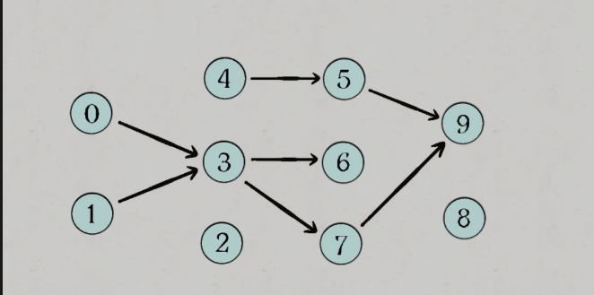

* content
{:toc}


#### 代码风格

```c++
class Solution {
public:
    void moveZeroes(vector<int>& nums) {
        int slowIndex = 0;
        for (int fastIndex = 0; fastIndex < nums.size(); fastIndex++) {
            if (nums[fastIndex] != 0) {
                nums[slowIndex++] = nums[fastIndex];
            }
        }
        for (int i = slowIndex; i < nums.size(); i++) {
            nums[i] = 0;
        }
    }
};
```


#### ACM模式

```c++
#include<iostream>
#include<vector>
using namespace std;
int main() {
    int n;
    while (cin >> n) {
        vector<int> gym(n);
        vector<int> work(n);
        for (int i = 0; i < n; i++) cin >> work[i];
        for (int i = 0; i < n; i++) cin >> gym[i];
        int result = 0;

        // 处理逻辑

        cout << result << endl;
    }
    return 0;
}
```


#### leetcode模式/ 核心代码模式

- 只关注**核心逻辑**, 培养算法思维

```c++
class Solution {
public:
    void moveZeroes(vector<int>& nums) {
        int slowIndex = 0;
        for (int fastIndex = 0; fastIndex < nums.size(); fastIndex++) {
            if (nums[fastIndex] != 0) {
                nums[slowIndex++] = nums[fastIndex];
            }
        }
        for (int i = slowIndex; i < nums.size(); i++) {
            nums[i] = 0;
        }
    }
};
```


#### 究竟什么是时间复杂度

时间复杂度是一个函数，它定性描述该算法的**运行时间**。

我们在软件开发中，时间复杂度就是用来方便开发者估算出程序运行的答题时间。

那么该如何估计程序运行时间呢，通常会估算算法的操作单元数量来代表程序消耗的时间，这里默认 CPU 的每个单元运行消耗的时间都是相同的。

假设算法的问题规模为 n，那么操作单元数量便用函数 f (n) 来表示，随着数据规模 n 的增大，算法执行时间的增长率和 f (n) 的增长率相同，这称作为算法的渐近时间复杂度，简称时间复杂度，记为 O (f (n))。


#### 什么是大o什么是大 O

这里的大 O 是指什么呢，说到时间复杂度，**大家都知道 O (n)，O (n^2)，却说不清什么是大 O**。

算法导论给出的解释：**大 O 用来表示上界的**，当用它作为算法的最坏情况运行时间的上界，就是对任意数据输入的运行时间的上界。

同样算法导论给出了例子：拿插入排序来说，插入排序的时间复杂度我们都说是 O (n^2) 。

输入数据的形式对程序运算时间是有很大影响的，在数据本来有序的情况下时间复杂度是 O (n)，但如果数据是逆序的话，插入排序的时间复杂度就是 O (n^2)，也就对于所有输入情况来说，最坏是 O (n^2) 的时间复杂度，所以称插入排序的时间复杂度为 O (n^2)。

同样的同理再看一下快速排序，都知道快速排序是 O (nlogn)，但是当数据已经有序情况下，快速排序的时间复杂度是 O (n^2) 的，**所以严格从大 O 的定义来讲，快速排序的时间复杂度应该是 O (n^2)**。

**但是我们依然说快速排序是 O (nlogn) 的时间复杂度，这个就是业内的一个默认规定，这里说的 O 代表的就是一般情况，而不是严格的上界**。

比如下面的常用算法的运行时间

| 排序算法 | 平均时间复杂度 | 最好情况    | 最坏情况 | 空间复杂度 | 排序方式 | 稳定性 |
| -------- | -------------- | ----------- | -------- | ---------- | -------- | ------ |
| 冒泡排序 | O(n^2)         | O(n)        | O(n^2)   | OG)        | In-place | 稳定   |
| 快速排序 | O(n log n)     | O( n  logn) |          | Olon n     | In-place | 不稳定 |


#### 抓主要矛盾

```bash
O(2*n^2 + 10*n + 1000)
= O(2*n^2 + 10*n)
= O(n^2 + n)
= O(n^2)

```


#### O (nlogn) 和 O (n) 

在算法的时间复杂度分析中，O (nlogn) 和 O (n) 是具有明显差异的复杂度级别。尽管它们都随着输入规模 n 的增加而增加，但增长率不同。

当 n 增加时，O (nlogn) 的增长速度比 O (n) 快得多。具体来说，当 n 增加时，O (nlogn) 的增长率是线性对数级别（即 n 乘以其对数）。而 O (n) 的增长率是线性级别（即 n 的倍数）。

举个例子，假设 n = 10^6，则 O (n) 的时间复杂度为 10^6，而 O (nlogn) 的时间复杂度为 10^6 * log₂(10^6)，约为 10^6 * 20 ≈ 2 * 10^7。可以看到，O (nlogn) 明显大于 O (n)。

当输入规模较大时，如 n = 10^9，O (n) 的时间复杂度为 10^9，而 O (nlogn) 的时间复杂度为 10^9 * log₂(10^9)，约为 10^9 * 30 ≈ 3 * 10^10。同样可以看到，O (nlogn) 明显大于 O (n)。

```bash
2^10 = 1024 ≈ 1000 
n = 1000 时
O(n) = 1000
O(nlogn) = (1000 * 10) = 10,000
```


### 一. Basic

#### 1.0 如何判断你的代码能不能在规定时间内通过:

- 机器处理的数据量为 1e8

- 因此，一般1e4 范围内的数据可以 O(n2), 1e5范围内的数据O(nlogn)


#### 1.1 概念辨析

| 命令                 | 解释                                            |
| -------------------- | ----------------------------------------------- |
| fun(x++)             | 输入到函数里面的是 **x**                        |
| fun(++x)             | 输入到函数里面的是 **x+1**                      |
| if(! flag)           | 当 **flag == 0**的时候执行                      |
| if(  1== a)          | 写出if(1=a)就会报错, 少打了=                    |
| int n = 1e5          | 少写几个零                                      |
| (a, b)中有           | b-a+1 个数字                                    |
| vector\<int>的中位数 | a[**n/2**] 或者 1/2 * (a[n/2] +a[**n/2 -1**]  ) |
| max({a, b, c,,,})    | abc,,,,中最大的数                               |


#### 1.2 各种初始化

有三种初始化方式, `()`, `=`, `{}`

- `()`初始化, 当你想用默认初始化时, Weight(), 会声明一个函数
- `{}`: 统一初始化, 从**概念上**可以用于**一切场合**, 表达一切意思的初始化, 有个新特性, 禁止**内建型别**之间进行**隐式窄化**型别转化

```c++
// -----------------------初始化-------------------------
// 列表初始化
vector<vector<int> > map = {{1, 0}, {-1, 0}, {0, 1}, {0, -1} };

// 多维数组的列表初始化, 和上面一样
int map[4][2] = {1, 0, -1, 0, 0, 1, 0, -1};

// 默认值的初始化, 全部是 0
int a[26] ={};
int a[26]{};

// 前三个是 1, 2, 3, 后面的值都是 0 
int a[26] ={1, 2, 3};

// 大括号 初始化
vector<int> v{1,3,4};
```


#### 1.3 巧用 引用`ref`

```c++
// -----------------------巧用引用-------------------------
void mysort(vector<int> &nums){
    // 如果要对数组元素进行改变, 可以使用引用. 
    for(int &x: nums){
        if(x% 2) x=-x;
    }
    sort(nums.begin(), nums.end());
}
```


#### 1.4 数组的中位数

- 长度为`len`, 奇数: 正中间, 偶数中间偏右
- 使用下标时, a[l, r]  $\frac{l+r}{2}$**中间靠左**


#### 1.6 类型上下界

| 缩写              | 类型              |
| ----------------- | ----------------- |
| INT_MAX   INT_MIN | int 类型最大最小  |
| UINT_MAX          | unsigned 最大最小 |
| LONG_MIN          |                   |
| LLONG_MAX         | long long最大最小 |
| ULONG_MAX         |                   |


#### 1.5 模板 访问类内部成员

- 模拟题才会用到

```c++
// 访问类内部的类型时, 一般而言, 需要实例化以后才可以访问类内部的对象
template<typename T>
class Myclass{
    typename T::subtype *ptr;
}
// 含义是指向类内部类型的指针
```


## 二. 进阶_容器使用

自然**有序**的容器, 可以直接使用 a.find(), 例如

- set multiset 
- map /multimap 
- unordered_set/unordered_multiset 
- unordered_map/unordered_multimap


| 容器                                                         | 底层数据结构      | 时间复杂度                                                  | 有无序 | 可不可重复 | 其他                                                         |
| ------------------------------------------------------------ | ----------------- | ----------------------------------------------------------- | ------ | ---------- | ------------------------------------------------------------ |
| [array](https://github.com/huihut/interview/tree/master/STL#array) | 数组              | 随机读改 O (1)                                              | 无序   | 可重复     | 支持**随机**访问                                             |
| [vector](https://github.com/huihut/interview/tree/master/STL#vector) | 数组              | 随机读改、尾部插入、尾部删除 O (1) 头部插入、头部删除 O (n) | 无序   | 可重复     | 支持随机访问                                                 |
| [deque](https://github.com/huihut/interview/tree/master/STL#deque) | 双端队列          | 头尾插入、头尾删除 O (1)                                    | 无序   | 可重复     | 一个中央控制器 + 多个缓冲区，支持首尾快速增删，支持随机访问  |
| [forward_list](https://github.com/huihut/interview/tree/master/STL#forward_list) | 单向链表          | 插入、删除 O (1)                                            | 无序   | 可重复     | 不支持随机访问                                               |
| [list](https://github.com/huihut/interview/tree/master/STL#list) | 双向链表          | 插入、删除 O (1)                                            | 无序   | 可重复     | 不支持随机访问                                               |
| [stack](https://github.com/huihut/interview/tree/master/STL#stack) | deque / list      | 顶部插入、顶部删除 O (1)                                    | 无序   | 可重复     | deque 或 list 封闭头端开口，不用 vector 的原因应该是容量大小有限制，扩容耗时 |
| [queue](https://github.com/huihut/interview/tree/master/STL#queue) | deque / list      | 尾部插入、头部删除 O (1)                                    | 无序   | 可重复     | deque 或 list 封闭头端开口，不用 vector 的原因应该是容量大小有限制，扩容耗时 |
| [priority_queue](https://github.com/huihut/interview/tree/master/STL#priority_queue) | vector + max-heap | 插入、删除 O (log2n)                                        | 有序   | 可重复     | vector 容器 + heap 处理规则                                  |
| [set](https://github.com/huihut/interview/tree/master/STL#set) | 红黑树            | 插入、删除、查找 O (log2n)                                  | 有序   | 不可重复   |                                                              |
| [multiset](https://github.com/huihut/interview/tree/master/STL#multiset) | 红黑树            | 插入、删除、查找 O (log2n)                                  | 有序   | 可重复     |                                                              |
| [map](https://github.com/huihut/interview/tree/master/STL#map) | 红黑树            | 插入、删除、查找 O (log2n)                                  | 有序   | 不可重复   |                                                              |
| [multimap](https://github.com/huihut/interview/tree/master/STL#multimap) | 红黑树            | 插入、删除、查找 O (log2n)                                  | 有序   | 可重复     |                                                              |
| [unordered_set](https://github.com/huihut/interview/tree/master/STL#unordered_set) | 哈希表            | 插入、删除、查找 O (1) 最差 O (n)                           | 无序   | 不可重复   |                                                              |
| [unordered_multiset](https://github.com/huihut/interview/tree/master/STL#unordered_multiset) | 哈希表            | 插入、删除、查找 O (1) 最差 O (n)                           | 无序   | 可重复     |                                                              |
| [unordered_map](https://github.com/huihut/interview/tree/master/STL#unordered_map) | 哈希表            | 插入、删除、查找 O (1) 最差 O (n)                           | 无序   | 不可重复   |                                                              |
| [unordered_multimap](https://github.com/huihut/interview/tree/master/STL#unordered_multimap) | 哈希表            | 插入、删除、查找 O (1) 最差 O (n)                           | 无序   | 可重复     |                                                              |


### 1 迭代器  iterator

#### 1.1 常用迭代器操作

```c++
// 迭代器在容器内部
vector<int> :: iterator it;
// 可以使用解引用操作符*，来访问迭代器指向的元素。
*it;
    
// 常用的操作有：
++ -- == !=
    
// 只有顺序容器才可以适应it + n, <=,>=
    
// 左闭右开的好处, 判断相等
first == last 代表空。

// 访问元素
it-> mem;


// 对两个迭代器进行相减操作，会计算它们之间的距离，
auto distance = it2 - it1;

// 如果迭代器所指向的容器不支持随机访问，例如 list 或 set，则不能使用迭代器相减操作, 可以考虑使用distance
// 位于 <iterator> 头文件中
#include<iterator>
typename std::iterator_traits<InputIt>::difference_type
    distance( InputIt first, InputIt last );

// 如果在调用 std::distance 函数时，第一个迭代器的位置在第二个迭代器的后面，则返回的结果为负数
auto d = std::distance(it1+3, it1);

// 在计算迭代器之间的距离时，要确保这两个迭代器都指向同一个容器中的元素或者它们都是指向同一块可寻址内存空间的合法指针。否则，std::distance() 函数的行为是未定义的。


// 找到最大值所在的元素的迭代器, 注意, it1 <= it2
#include<algorithm>
max_element(it1, it2);
min_element(it1, it2);
```


#### 获取迭代器的地址

```c++
for (auto it = v.begin(); it != v.end(); ++it) {
    std::cout << &(*it) << " ";
}
```


### 2 序列式容器

#### 2.1 string


````c++
//四种基本的初始化，顺序容器的初始化，默认，复制，范围，n个值
string s1;
string s1(s2);
string s3("sdf");
string s4(n, 'c');

// 输入 string 
string s4;
cin >> s4; 
    
// 从开始位置复制到最后
string s5(s1, pos);
string s6(s1, pos, len);

// operator+=
s1+= s2;
s1+= 'c'; 

// 清空
s.clear();

// 用迭代器内元素替换
s.assign(it1, it2);
s.assign(n, value);

// 也可以直接使用下标进行修改
s[i] = '0';


// // 也没有 iterator 的形式
// 查找的类型, 开始位置
size_t find (char c, size_t pos = 0) const;
size_t find (const string& str, size_t pos = 0) const;
size_t find (const char* s, size_t pos = 0) const;
// 开始位置, 结束位置
size_t find (const char* s, size_t pos, size_t n) const;


// 截取子串, 只有使用下标的形式
// 若超出字符串长度，则默认从 pos 到字符串末尾提取所有字符。
string substr (size_t pos = 0, size_t len = npos) const;

// 临时将string对象转换为C风格字符串。不能直接用于修改字符串内容。
const char* string::c_str();

````


```c++
//---------------------插入删除--------------
// 插入字符串, 字符串的子串
string& insert (size_t pos, const string& str);	
string& insert (size_t pos, const string& str, size_t subpos, size_t sublen);
string& insert (size_t pos, const char* s);
string& insert (size_t pos, const char* s, size_t n);

// 插入char 类型必须要有数量参数
string& insert (size_t pos, size_t n, char c);    
void insert (iterator p, size_t n, char c);

iterator insert (iterator p, char c);

// 删除, 默认是全部删除, 单点删除只支持迭代器
string& erase (size_t pos = 0, size_t len = npos);
iterator erase (iterator p);
iterator erase (iterator first, iterator last);
```


```c++
// ----------------string与 数值类型---------
// 在头文件 string 中
// string => int
int stoi (const string& str, size_t* idx = 0, int base = 10);

// string => double
double stod(const string& str, size_t* idx = 0);

// 转换为 string 
// int/ double float => double
string s1 = to_string(123);
string s2 = to_string(4.5);

//字符处理<cctype>
#include <cctype>
// 判断一个字符是否为字母或数字
isalnum(char); 
isalpha(char);

isdigit(char);
islower();
isupper();


toupper(c);
tolower(c);
// 判断是否是字母等
isalpha 字⺟母（包括⼤大写、⼩小写）

isalnum（字⺟母⼤大写⼩小写+数字）
isblank（space和\t）
isspace（space、\t、\r、\n）
```

输入输出

```c++
// 输入到 string
string str;
cout << "请输入一个字符串：";
cin >> str; // 用户输入 "Hello, World!"，则 str 的值为 "Hello,"
    
// 当cin遇到空白字符时就停止，最标准的方法是调用getline(cin,str)函数。
string line;
getline(cin, line); // 用户输入 "This is a sentence."，则 line 的值为 "This is a sentence."

// 从文件输入
ifstream fin("file.txt");
string str;
fin >> str;
```


#### 2.2 vector

the link with capacity

- 如果两个`vector`相比较, 返回第一个不相同元素的 `<` 比较结果，
- 内部以连续的方式存放, 当没有空间存放时, 会重新分配空间, 原来的迭代器会失效( 因为**地址**发生了改变),  **插入会使该容器所有的迭代器失效**

```c++
//初始化
vector<int> v1;
vector<int> v2(v1);     //复制v1
vector<int> v3(n, value);   //n个值为value的元素
vector<int> v3(n);          //n个初始元素的副本。
vector<int> v4(a+1, a+3) //使用数组进行初始化，不包括最后一个地址的元素。

//a的大小
a.size() ;
//判断是否为空
v.empty() ;

//在容器的最后添加一个值为t的数据，容器的size变大。
v.push_back(t);
//删除容器的末尾元素，仅仅删除，没有返回。
a.pop_back() ; 


//第一个元素，最后一个元素的引用（值）。
v.back();
v.front();

//----------------------大小有关的操作---------------------
//清空
v.clear();
//调整大小。
v.resize(n, t);
v.resize(n);
//删除，返回删除元素的下一个位置，也是左闭右开。
v.erase(it);
v.erase(it1, it2);

//插入it 前面, 代表 成为它 , 原来序号是3, 插入的新值序号也是3
//同时返回新元素的迭代器
//第一个版本, 插入一个新的值
v.insert(it, value);
//第二个版本, 插入n个新的值
v.insert(it, n, value);
//插入it前面，从it1 到it2 的元素
v.insert(it , it1, it2);

//第一个元素的地址, 要把vector 和数组区分开。
&v[0];
```

```c++
// ----------------------多维vector----------
// 多维vector 只能添加 vector<int>
// 若想定义A = [[0,1,2],[3,4]]，有两种方法。
vector<vector<int> > A;
vector<int> B = {0,1,2};
vector<int> C = {3, 4};
A.push_back(B);
A.push_back(C);
 

for(int i = 0; i < 2; ++i) {
     A.push_back(vector<int>());  
}
A[0].push_back(0);

// vector<vector<int> >A中的vector元素的个数
len = A.size();
// vector<vector<int> >A中第i个vector元素的长度
len = A[i].size();
```


**避免因为插入导致的迭代器失效**

```c++
//一个容器中, 读取完元素后, 再插入一个值
auto first = a.begin(), last = a.end()
while(first != a.end()){
	first = a.insert(++first, 666);
	++first;
}
```

关系运算符 ------- 容器的比较是基于**容器内元素**的比较

- 当长度相同且元素相等, 则相等
- 比较的结果 取决于 **第一个不相等**的元素
- 当 `vector<vector>`进行比较时, 空的 vector 被放到前面


#### 2.3 list

```c++
// 因为是双向链表, 所以 it 可以++, --
list<int> l{1, 2, 3, 4};
// 多个元素的值
list<pair<int, int> > l;

// 获取元素的值
l.front();
l.back();

// 头尾均可插入删除
l.push_front();
l.pop_front();
  
l.push_back();
l.pop_back();

// 插入
l.insert(it, val);
l.insert(it, n, val); //n 个 value
l.insert(it, it_first, it_last);    
    
// delete
l.erase(it);
l.erase(it_first, it_last);

// 拼接
// 整个l2 拼接到 it1的位置
l1.splice(it1, l2)
// 将 l2 的 l2_pos 指向元素（节点）切除，拼接到 l1 的 l1_pos 处（l1 和 l2 可相同）
l1.splice (iterator l1_pos, list<T,Allocator>& l2, iterator l2_pos ); 
l1.splice(head, l1, it_2);
//将容器lt6的指定迭代器区间内的数据拼接到容器lt5的开头
lt5.splice(lt5.begin(), lt6, lt6.begin(), lt6.end()); 

// 删除重复元素
l.unique(); 

// 删除满足条件的元素 bool fun()
lt.remove_if(fun);
```


#### 2.4 deque

```c++
// 初始化
deque<int> de(10, 666);

de.push_back(1);
de.push_front(1);
```


#### 2.5 stack

```c++
stack<int> st;

// 判断是否为空
st.empty();

// 入栈
st.push(1);

// 返回栈顶元素
st.top()

// 出栈
st.pop();
```


#### 2.6 queue

```c++
queue<int> qu;

// 进入队列
qu.push(a);

// 返回队头元素
qu.front();

// 队头的元素 出队
qu.pop();
```


#### 2.7 priority_queue 

实质: **堆**

```c++
// template <class T, class Container = vector<T>, class Compare = less<typename Container::value_type> >
// class priority_queue;
// 默认是按小于 (less) 的方式比较，这种比较方式创建出来的就是 大顶堆。
// 就当作 比较的时候 先输入 子节点, 然后输入 父节点
priority_queue<pair<int, int>, vector<pair<int, int>>, compare> heap;

// 初始化方式, 使用迭代器初始化
(it1, it2);

// 和 stack 很像
// 添加元素
heap.push();

// 获得堆顶元素
heap.top()

// 删除元素
heap.pop();
```


#### 2.8 bitset 位运算

与（AND）、或（OR）和异或（XOR）是逻辑运算符，在计算机编程中有一些特殊性：

- 与和或 亦或 运算都是**可结合的和可交换**的，即表达式中多个操作数的**顺序**不影响最终结果。

异或（XOR）的特殊性：**相同为假**, 不同为真

- 异或运算可以用于检测两个值是否不同，如果两个值不同，则结果为真。
- 在编程中，异或运算常用于交换两个值的变量，而无需引入第三个中间变量。


- `1`的特殊性: 二进制形式如 `000000001`, 只有末尾一个`1`
- 编程时，请注意运算符的**优先级**。例如 `==` 在某些语言中**优先级**更高, **位运算需要加括号**

```c++
// 将x左移 n位, 补零 
x << n;

// 判断 第 d 位是否为 1
// 1 的特殊性, 只有最低位是 1
bit =  0b11001;
// 右移也是补 0 
bit >>d &1 ;

// 按位与操作符的返回值是一个新的二进制数
// 每一位都是两个操作数相应位执行**逻辑操作**的结果

// 一个有 n 位数字的集合如何表示全集
(1<<n)-1  ;

// 遍历集合
for (int i = 0; i < n; i++) {
    if ((s >> i) & 1) { // i 在 s 中
        // 处理 i 的逻辑
    }
}

// 枚举 从空集到 全集
for (int s = 0; s < (1 << n); s++) {
    // 处理 s 的逻辑
}

// 设集合为 s，从大到小枚举 s 的所有非空子集 sub
// 暴力做法是从 s 出发，不断减一直到 0，但这样中途会遇到很多并不是s 的子集的情况。
for (int sub = s; sub; sub = (sub - 1) & s) {
    // 处理 sub 的逻辑
}
    
```


```c++
#include "biset"
// 和一般的容器不一样, <>中间是多少个二进制位数, 5表示5个⼆二进位
// 默认在高位补零, 下面就是 "00011"
bitset<5> b("11"); 

// 如果用较大的整数向较小的 bitset 对象赋值，也会发生同样的截断错误，不会产生警告或异常, 并且会将高位丢弃
bitset<3> (16) ;


// 从整数创建
std::bitset<8> b(n);
// 高位置截断
string str = bs.to_string().substr(bs.to_string().find('1'));

bitset<5> b; 都为0
bitset<5> b(u); u为unsigned int，如果u = 1,则被初始化为10000
bitset<5> b(s); // s为字符串串，如"1101" -> "10110"
bitset<5> b(s, pos, n); // 从字符串串的s[pos]开始，n位⻓长度

// 使用下标, 注意, 重要区别
// b[0] 访问的是 b 的最右边的一位，即二进制数的最低位
// 访问 std::bitset 对象的元素时，如果所访问的元素的值为 0，则索引操作符返回 false；如果所访问的元素的值为 1，则索引操作符返回 true。

// 可以直接输出
cout << bitset<8>(15);

// b中⼆二进制位的个数
 b.size(); 
// 统计1的位数
int count = b.count(); 
    
// 0 1操作
//把b的下标为4处置1
b.set(4); 

//所有位归零
b.reset(); 
b.reset(3); //b的下标3处归零

// 操作符, 必须位数相同才能操作
std::bitset<8> b3 = b1 & b2;   // 位与
std::bitset<8> b4 = b1 | b2;   // 位或
std::bitset<8> b5 = b1 ^ b2;   // 位异或
std::bitset<8> b6 = b1 << 2;   // 左移 2 位
std::bitset<8> b7 = b1 >> 2;   // 右移 2 位


// 所有位都为真
cout << endl << b.any(); //b中是否存在1的⼆二进制位
// 所有位都为假
cout << endl << b.none(); //b中不不存在1吗？
cout << endl << b.count(); //b中1的⼆二进制位的个数

cout << endl << b.test(2); //测试下标为2处是否⼆二进制位为1

b.flip(); //b的所有⼆二进制位逐位取反
unsigned long a = b.to_ulong(); //b转换为unsigned long类型
```


### 3 关联式容器

#### 3.1 pair

```c++
typedef pair<int, int> mypair;

// map 中 key 类型是 const 类型
map<int, int> mp;
for(auto & node: mp){
    // 实际要写成
    pair<const int, int> node:
}

pair<int, int> p;
// 只有两个成员, 注意不是成员 函数
p.first;
p.second;

```


#### 3.2 map

**map/multimap属于 关联式 容器，底层结构是用 二叉树( 红黑树 ) 实现, 时间复杂度为O(logn)。**

```c++
a.size(); //返回容器中元素的数目
a.empty(); //判断容器是否为空
swap(st); //交换两个集合容器

a.count(key); //统计key的元素个数

// 清除元素
void erase (iterator position);
size_type erase (const key_type& k);
void erase (iterator first, iterator last);

void printMap(map<int,int>&m){
    for (map<int, int>::iterator it = m.begin(); it != m.end(); it++){
    	cout << "key = " << it->first << " value = " << it->second << endl;
    }
    cout << endl;
}
```


#### 3.1 unordered_map

**基于哈希表, 空间大, 时间复杂度不稳定,平均为常数级O(c), 取决于哈希函数,极端情况下为O(n)**

- `unordered_map<pair<int, int>, int> mp`会报错, 因为没有给`pair`做 Hash 函数
- `map` 里面是通过操作符 `<` 来比较大小，而 pair 是可以比较大小的。

```c++
// 注意：C++11才开始支持括号初始化
unordered_map<int, string> mp={{ 1, "张三" },{ 2, "李四" }};

// 使用[ ]进行单个插入，若已存在键值，则赋值修改，若无则 插入。
mp[2] = "李四";   //不会插入  

// 使用键值 删除
size_type erase ( const key_type& k );

//   使用insert和pair插入, 麻烦
mp.insert(pair<int, string>(3, "王二"));

//遍历输出+迭代器的使用
auto iter = mp.begin();//auto自动识别为迭代器类型unordered_map<int,string>::iterator
while (iter!= myMap.end()){  
    cout << iter->first << "," << iter->second << endl;  
    ++iter;  
} 

unordered_map<Key,T>::iterator it;
it->first;               // same as (*it).first   (the key value)
it->second;              // same as (*it).second  (the mapped value) 
```


#### 3.3 set

```c++
// 定义⼀一个空集合s
set<int> s;

// 增 
s.insert(1); 

// 删除集合s中的1这个元素
s.erase(1); 

// 查
s.count(1);

// s.find() 返回迭代器
// 根据 STL 前毕后开的特点 如果结果等于s.end()表示未找到
s.find(2) != s.end()) << endl; 
```


#### 3.4 multiset

```c++
multiset<int> set;
// 使用键值删除会全部删除
st.erase (40);      // [10 30 40 40 50 60]  ->  [10 30 50 60]

```


### 4 算法库 & 常用库

#### 4.1 sort 函数

```c++
# include <algorithm>

// 默认，v从⼩小到⼤大排列, 并且是前闭后开
sort(v.begin(), v.end());

//cmp函数返回的值是bool类型
bool cmp(int a, int b) {
	return a > b; // 从⼤大到⼩小排列列
}

// 有时候这种简单的if-else语句句我喜欢直接⽤用⼀一个C语⾔言⾥里里⾯面的三⽬目运算符表示～
bool cmp(stu a, stu b) {
	return a.score != b.score ? a.score > b.score : a.number < b.number;
}

// 也可以使用 lambda 表达式
sort(envelopes.begin(), envelopes.end(), [](const auto& e1, const auto& e2) {
    return e1[0] < e2[0] || (e1[0] == e2[0] && e1[1] > e2[1]);
});
```


#### 4.2 max & min & max_element() & min_element

```c++
// max min 四 个版本
template <class T> const T& max (const T& a, const T& b);
template <class T, class Compare>  const T& max (const T& a, const T& b, Compare comp);
template <class T> T max (initializer_list<T> il);
max({3, 4, 5});
template <class T, class Compare>  T max (initializer_list<T> il, Compare comp);


```


```c++
// 找最大最小值, 返回的是 **迭代器**
template <class ForwardIterator>  ForwardIterator max_element (ForwardIterator first, ForwardIterator last);

template <class ForwardIterator, class Compare>  ForwardIterator max_element (ForwardIterator first, ForwardIterator last, Compare comp);

```


#### 4.5 lower_bound()

```c++
// 二分查找最低位
It lower_bound(ForwardIt first, ForwardIt last, const T& value);

// 重载形式
ForwardIt lower_bound(ForwardIt first, ForwardIt last, const T& value, Compare comp);
```


#### 4.3 累加accumulate

- 使用时注意初值
- `accumulate(nums2.begin(), nums2.end(), 0LL)` 中的 `0LL` 表示将初始值设为 long long 类型的 0 值，而 `accumulate(nums2.begin(), nums2.end(), 0)` 中的 `0` 表示将初始值设为 int 类型的 0 值。会有**溢出**风险

```c++
// 默认相加的操作, 最后一个参数为初始值, 必须有初始值
accumulate(it1, it2, init_value);

// 自定义运算
std::string str1 = "hello";
std::string str2 = "world";

int sum = std::accumulate(str1.begin(), str1.end(), 0,
   [=](int acc, char c) {return acc + c + str2[c - 'a'];});


```


```c++
template<class InputIt, class T>
T accumulate(InputIt first, InputIt last, T init) {
    for(; first != last; ++first) {
        init = init + *first;
    }
    return init;
}

//
template<class InputIt, class T, class BinaryOp>
T accumulate(InputIt first, InputIt last, T init, BinaryOp op) {
    for(; first != last; ++first) {
        init = op(init, *first);
    }
    return init;
}
```


#### unique

- 让区间内的元素**唯一**
- 使用之前先排序
- 只能移除相邻的重复元素，并将重复元素移动到区间的末尾，然后返回指向新的区间尾部

```c++
// 返回最后一个唯一元素  
it unique(nums.begin(), nums.end());
```


#### 4.2 常用算法_find fill for_each

```c++
//查找元素, find返回迭代器, 如果没找到, 返回it2, 因此, 检查返回值和it2 是否相等可以看出是否找到. 
find(it1, it2 , value);

//将value的副本写入指定的范围, 只对输入范围内部的元素进行写入操作
fill(it1, it2, value);
    
//对于每一个元素都执行的操作
for_each(it1, it2, func)

for_each(a.begin(), a.end(),[&](int x){cout<< x<< endl;});
```


#### 4.4 copy()

```c++
// copy() 函数定义在 algorithm 头文件中。
template <typename InputIt, typename OutputIt>
OutputIt copy(InputIt first, InputIt last, OutputIt dest) {
    while (first != last) {
        *dest++ = *first++;
    }
    return dest;
}
```


## 三. 进阶_ 算法模板

### 1 数值处理

#### 1.1 数值处理-----反转数字

```c++
for(int num : nums){
    int re =0;
    while(num){
        re = re*10 + num% 10;
        num/=10;
    }
    cout<< re<< endl;
}
```


#### 1.2 数值处理------最大公因子

```c++
// 在algorithm中, 有__gcd()函数
int gcd(int a, int b){
    // 默认 b 为较小的
	int r;
	while (b) {
		r = a % b;
		a = b;
		b = r;
	}
	return a;
}
```


#### 位运算

**位运算符**（也称为按位运算符）是用来操作操作数的二进制位的。

- 按位与（&）：将两个操作数的每一位进行比较，如果两个操作数在同一位上都是 1，则结果为 1，否则为 0。
- 按位或（|）：将两个操作数的每一位进行比较，如果两个操作数在同一位上都是 0，则结果为 0，否则为 1。
- 按位**异或**（^）：将两个操作数的每一位进行比较，如果两个操作数在同一位上**相同**，**则结果为 0**，否则为 1。
- 按位取反（~）：将操作数的每一位都取反（0 变成 1, 1 变成 0）。
- 左移（<<）：将左侧操作数的所有二进制位向左移动指定的位数，右侧的空位用 0 补充。
- 右移（>>）：将左侧操作数的所有二进制位向右移动指定的位数，左侧的空位用符号位（对于有符号类型）或 0（对于无符号类型）补充。


按位亦或

- 一个数和 0 做 XOR 运算等于**本身**：a^0 = a
- 一个数和其本身做 XOR 运算等于 0：a^a = 0
- XOR 运算满足**交换律和结合律**：a^b^a = (a^a)^b = 0^b = b


#### 1.3 数值处理------求幂

分为奇数和偶数

#### 1.4 数值处理------求模运算

自然数取余定义分为两种：

- 定义 1：如果 a 和 d 是两个自然数，d 非零，可以证明存在两个唯一的整数 q 和 r，满足 `a=qd+r且0 ≤ r < d`（其中 q 为商，r 为余数）。
    定义 1 一般作为数学中的取余法则，即两个数取余，余数总是为**正数**。

```c++
// C++中 负数 % n 并不做处理
// 在 C++ 中，对于负数 a 和正整数 n 进行模运算（求余数），其结果的符号与被除数 a 的符号相同。具体地说，当 a <0 时，a % n 的结果为负数，当 a>= 0 时，a % n 的结果为非负数（即自然数）
// 在 C++ 中，对于除数为负数的情况，取模运算结果未定义。因此，应该避免除数为负数的情况。
cout<< (-1) %3<<endl; // -1

// 两数相加再取模
(m + n) % p = (m%p + n%p) %p

// 两数相乘再取模
(m * n) % p = (m%p) * (n%p) %p

// 两数相减再取模
(m - n) % p = ((m%p - n%p) + p) %p
```


#### 1.5 数值处理-------模幂运算

```c++
// 先对 a^b % c
// 其中, b是数组 例如[1,2] 代表 12
```


#### 字符串数值处理

- 数位 dp

```c++
// 找到所有 小于该数值的字符串表示
unordered_map<int, int> mp;

function<int(int, bool )>func = [](int start, bool islimit)-> int{
    // wrong case
    if(start == len)// base case
    
    // 当前的唯一状态表示, 要有 start等信息
    int cur;
        
    if(!islimit && mp.count(cur)){
        return mp[cur];
    }
    
    int up  = islimit? s[start]-'0': 9;
    
    int res = 0;
    for(int i = 0; i<= up; ++i){
        // 只有当前位置有限制, 且等于 up 时, 才会 有限制
        res += func(start, islimit && i == up)
    }
    mp[cur] = res;
    return res;
}
```


#### 排序技巧

```c++
// 添加元素所对应的坐标, 然后进行自己的排序
vector<vector<int> > nums;

for(int i = 0; i < m; i++)
   nums[i].push_back(i);
sort(nums.begin(), nums.end(), cmp);


// 两个 vector 排序
// 用来比较两个序列中从前往后逐个元素进行比较，直到出现不同为止。
// 如果全部元素都相等，则比较两个序列长度，长度较短的序列小于长度较长的序列。
vector<int> v1 = {1, 2, 3,};
vector<int> v2 = {1, 2, 3, 5}; 
// v1 <v2 

// vector<pair<>> 排序
// 默认按照 pair::first的大小
```


### 2 回溯 = (先根)DFS + 剪枝

```python
res = []
# can是选择列表
def backtrack(res, track, can):
    if 满⾜结束条件:
        res.add(track)
        return

    # 时间复杂度O(n^n)
    for i in can:
        if(满足剪枝条件):
            #判断是否需要剪枝, 也就是将不符合题意的循环删除
            continue
            
        #在递归之前做出选择，在递归之后撤销刚才的选择
        track.push_back(i)
        backtrack(res, track, can)
        track.pop_back(i)
```


#### BFS

- 重点在如何表示状态, 以及状态的转变
- 状态的组成必须**唯一**, 不能有状态是相同的
- 状态的组成必须**完备**
- 

```c++
// encode the state

typedef <> State
queue<State> qu;

// 防止走回头路, 可以使用 unordered_set / set/ vector / 数组
unordered_set<State> visit;
qu.push(start);
visit.insert(start);

int step = 0;
while(qu.size()){
    int len = qu.size();
    for(int i =0; i<len; ++i){
        State cur = qu.front();
        qu.pop();
        
        // 处理, 进行每一步的操作
        if(finished){
            return step;
        }
        
        // k 是一共有多少种下一步的操作
        for(int j =0; j<k; ++j){
            State next ;
            qu.push(next);
            visit.insert(next);
        }
    }
    step++;
}
```


### 3 单调栈

```c++
// ------------------从后向前计算------------------
// 找到该元素 右边 第一个 比自己大的元素
len = nums.size();
vector<int> ans(len, -1);
stack<int> st;
//从后向前遍历, 小(等于) 当前元素的出去
for(int i =len - 1; i> -1; --i){
    while(!st.empty() &&  nums[i] >= st.top()){
        st.pop();
    }
    ans[i] = !st.empty()? st.top() : -1;
    st.push(nums[i]);
}


// -------------------从前往后计算-----------------
// 找到该元素 右边 第一个 比自己大的元素
stack<int> st; // 递增栈(从栈头到栈底的顺序)
vector<int> result(nums.size(), 0);
for (int i = 0; i < nums.size(); i++) {
    while (st.size() && nums[i] > nums[st.top()]) { // 注意栈不能为空
        // 当前元素 是 已遍历元素的 解
        result[st.top()] = i;
        st.pop();
    }
    st.push(i);
}


```


### 双指针

滑动窗口的**右端点**一定会到达**答案的右端点**，这时候左端点就会收缩到答案的左端点了


### 图论

#### 4.1 图的遍历( 使用邻接矩阵 )

```c++
// 图遍历框架 
// 图的遍历和一般 回溯 框架还是有所不同的, 因为传到traverse 函数中的点还没有进行过遍历, 所以衍生出了两种方法:
// - 丢进函数之前 对其进行处理
// - 在for循环之前进行处理, for循环中不进行处理( 更一般 )

void traverse(vector<vector<int> > &graph, int s) {
    if (visited[s]) return;
    // 经过节点 s
    visited[s] = true;
    for (TreeNode neighbor : graph.neighbors(s))
        traverse(neighbor);
    // 离开节点 s
    visited[s] = false;   
}
```

图遍历过程中, 有些节点被访问了两次( 遍历时, visit[i] == 1 )的情况:

- 图中有环
- 某节点 的 入度 大于等于 2

要 注意 区分这两种情况


#### 4.2 二分图

> 定义
>
> 二分图的顶点集可分割为两个互不相交的子集，图中每条边依附的两个顶点都分属于这两个子集，且两个子集内的顶点不相邻。
>
> 二分图**不是 "回溯"**

```c++
//遍历一遍图，并且一边遍历一遍染色，看看能不能用两种颜色给所有节点染色，且相邻节点的颜色都 不相同。

bool isBipartite(vector<vector<int>>& graph) {
    // the number of nodes
    int len = graph.size();

    vector<int> visit(len, 0);
    vector<int> color(len, 0);
    int res = 1;
    // 防止有单独的子图
    for(int i=0; i<len; ++i){
        if(visit[i] == 0)
            //深度遍历, 进行染色, start染c, 与start相连的点染 -c
            dfs(graph, i, visit, color, res, 1);
    }

    return res;
}

void dfs(vector<vector<int> > &g, int start, vector<int> &visit, vector<int> &color, int &res , int c){
    if(!res) return;

    // if(visit[v] == 1) return;
    // 没有遍历过(染色)
    if(visit[start] == 0){
        visit[start] = 1;
        color[start] = c;
        cout<< "node "<< start<< "=\t "<< c<< endl;
        for(int nextnode : g[start]){
            dfs(g, nextnode, visit, color, res, -c);
        } 

    }
    else if(color[start] == c) return;
    else {
        res = 0;
        //cout<< "node"<< start<< "\t is unsuccessful"<< endl;
    }
}

```


#### 4.3 判断是否有环

```c++
bool hascycle(vector<vector<int>>& g) {
    // 检测是不是拓扑序列  也就是 检查 是否有环
    // 使用回溯法, 如果访问的节点在path中, 那么就是有环
    // 为什么不使用 visited, 因为visited是全局的, 
    int len = g.size();

    int res = 1;

    vector<int> visited(n, 0), path(n, 0);
    for(int i = 0; i<n; ++i){
        dfs(res, g, visited, path, i);
        if(!res) return false;
    }

    return true;
}   

void dfs(int &res, vector<vector<int> > &g, vector<int> &visited, vector<int> path, int start){
    if(!res) return;

    // [----------------------bug is here--------------------]
    // 注意这两者的顺序, 先判断是否 在路径上, 因为在路径上一定浏览过, 
    if(path[start] ==1 ) res = 0;
    if(visited[start]) return;
    path[start] =1;
    visited[start] = 1;
    for(int next : g[start]){
        dfs(res, g, visited, path, next);
    }
    path[start] = 0;
}

```


#### 4.4  拓扑排序




```c++
vector<int> findOrder(vector<vector<int> > g ) {
    // 返回 拓扑排序
	// 结论 将后序遍历的结果进⾏反转（逆后序遍历顺序），就是拓扑排序的结果。
    int len = g.size();

    // 假设我们当前搜索到了节点 u，如果它的所有相邻节点都已经搜索完成，那么这些节点都已经在栈中了，此时我们就可以把 u 入栈
    vector<int> res, trace, path(numCourses, 0), visited(numCourses, 0);
    int flag = 1;

    for(int i =0; i< numCourses; ++i){
        // start 是要处理的点 
        // cout<< start<<
        if(!visited[i]) dfs(flag, trace, g, visited, path, i);
        if(!flag) return {};
    }
    // 最后反转一下
    reverse(trace.begin(), trace.end());
    return trace; 


}

void dfs(int &flag, vector<int> &trace, vector<vector<int> > &g, vector<int> &visited, vector<int> &path, int start){
    if(!flag) {return;}

    if(path[start]) {
        flag = 0;
        return;
    }
    if(visited[start]) return;

    path[start]=1;
    visited[start] = 1;
    for(int next: g[start]){
        dfs(flag, trace, g, visited, path, next);
    } 
	// 到了尽头才添加, 后序遍历
    trace.push_back(start);
    path[start] =0;

}
```


#### 5.1 双指针------二分查找

```c++
int searchInsert(vector<int>& nums, int target) {
    int left =0, right = nums.size()-1;

    while(left <= right){
        int mid = left+ (right - left )/2;
        // 相等的时候向左收缩边界, 也就是修改 r
        if(nums[mid] >= target) right=mid-1;
        else if(nums[mid] < target) left =mid+1;
    }
    return left;
}
```


#### 5 双指针------滑动窗口

O(n) 时间内解决 **子串, 子数组**问题

- 窗口其实就是 **[left, right)**, 窗口大小是 **right - left**
- right 向右寻找可行解，left 向右寻找最优解
- right 表示**待处理**的节点
- 等价于枚举**左端点**

```python
#-----------------V1----------------
while right < s.size():
    # 处理s[right]
    ++right;
    
    while( shirink && l<r ):
        # 满足 题目 条件的在这里更新
        updata res
        # 处理left
        ++left

#-----------------V2----------------     
while right < s.size():
    # 处理s[right]
    ++right;
    
    while(!shirink  && l<r ):
        # 处理left
        ++left    
    #不满足条件的在这里更新
    updata res
```


### 高级数据结构

#### 前缀和 与 差分

- 我们可以通过如下方式构造其前缀和数组 s：`s[1] = a[1]，s[i] = s[i-1] + a[i] (2 ≤ i ≤ n)`

- 我们可以通过如下方式构造其差分数组 d：`d[1] = a[1]，d[i] = a[i] - a[i-1] (2 ≤ i ≤ n)`, 

- 原始数组`a[i]= `$\sum(d_i)$, 所以差分是前缀和的逆运算

- 如果想对原数组`[l, r]`内的元素加 `c`, 只需要对差分数组以下操作

    - `d[l]+=c` 以及`d[r+1] -= c`
    - 开辟数组的时候, 要多开辟一位

    


