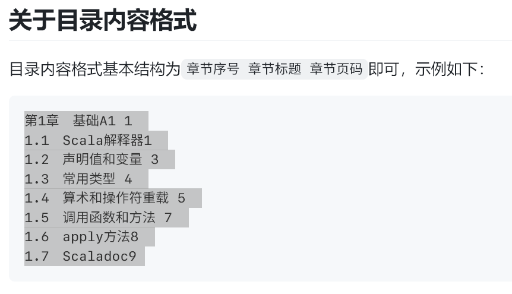
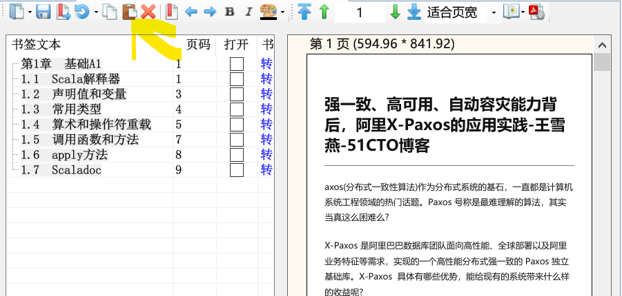

* content
{:toc}
限于 github 只能传输 <25 m 的文件的限制

### 0 auto 办公自动化

- 1 答案查找
- 2 将子文件夹内的问题件移出 并 **重命名**为 该子文件夹名称

### 1 PDF软件

#### 1.1 pdf 目录添加

有目录列表的话，复制粘贴到书签栏，保存文档就行啦。

复制目录列表：

打开 PDF 文档，按粘贴按钮，将列表粘贴到书签栏：

[pdfdir](https://github.com/chroming/pdfdir)

[获取pdf目录的网站](http://search.china-pub.com/)

[ririv/QuickOutline: 给PDF添加大纲、目录。Add outline to PDF (github.com)](https://github.com/ririv/QuickOutline)

#### 1.2 pdf 补丁丁

[软件地址](https://github.com/wmjordan/PDFPatcher)

[使用说明](https://post.smzdm.com/p/anx09ww3/)

#### 1.3 pdf 复制

https://github.com/wangfreexx/PDFCopyPasteNew/releases/tag/V1.0

#### 1.4 pdf patcher 去除密码

[pdf去除密码_百度搜索 (github.com)](https://github.com/wmjordan/PDFPatcher)

文件---文档属性----设置PDF文件的修改方式(左下角)---压缩清理

#### 天若OCR专业版

- 识别文字：

    调用各大服务器百度、腾讯、阿里等一系列服务商接口实现云端识别，

- 识别翻译：
        识别后翻译平平无奇的功能。暂时提供百度、搜狗、彩云小译、还有一个自定义接口功能。

- 截图功能：丰富的截图标注功能、和微信截图有些类似，可以二次编辑，只因为我喜欢这种编辑模式。  备注：矩形、圆形、铅笔、箭头、高亮、马赛克、模糊、序号。满足你灵魂画师的需求。

- 贴图功能：参考自伟大的 snipaste。贴图、取色、文本便签、可以编辑。

- 录制 GIF 功能：好吧，前面的 gif 都是我的软件录制的。得益于 screentogif 的开源。

### 3 code 

#### 3.1 source insights

- 好用的查看代码软件

      

### 4 网盘软件

#### 2.1 百度云盘

- [伪 pandownload](https://www.pandownload.net/index.html)
- 再买一个**共享会员**的账号, 美滋滋

### 2 clash

> https://github.com/Fndroid/clash_for_windows_pkg
>
> 

- [机场在这里](https://www.mojie.me/#/login)
- 按流量付费, 十五元, 130g, 不限时间

### 6 视频软件

#### [Bili录播姬 ](https://github.com/BililiveRecorder/BililiveRecorder)
