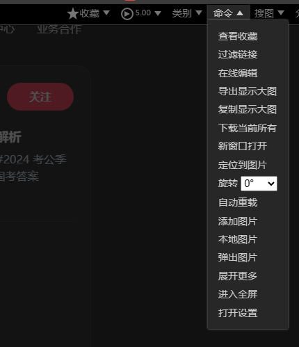

* content
{:toc}
### 如何批量下载小红书的图片

- 首先下载油猴插件
- 其次安装该脚本[Picviewer CE+ (greasyfork.org)](https://greasyfork.org/zh-CN/scripts/24204-picviewer-ce)
- 使用脚本下载图片

### 脚本使用

- 打开连接
- 按住`g`
- 右上角`命令`-`下载当前所有`

快捷键

- 打开图库（加功能键为全局）9
- 打开大图`a`
-  打开当前图片`C`
- 打开放大镜观察`m`
- 下载`d`

