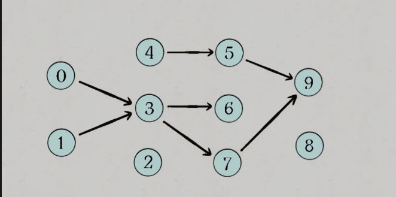

* content
{:toc}
## 三. 进阶_ 算法模板

### 1 数值处理

#### 1.1 数值处理-----反转数字

```c++
for(int num : nums){
    int re =0;
    while(num){
        re = re*10 + num% 10;
        num/=10;
    }
    cout<< re<< endl;
}
```


#### 1.2 数值处理------最大公因子

```c++
// 在algorithm中, 有__gcd()函数
int gcd(int a, int b){
    // 默认 b 为较小的
	int r;
	while (b) {
		r = a % b;
		a = b;
		b = r;
	}
	return a;
}
```


#### 位运算

**位运算符**（也称为按位运算符）是用来操作操作数的二进制位的。

- 按位与（&）：将两个操作数的每一位进行比较，如果两个操作数在同一位上都是 1，则结果为 1，否则为 0。
- 按位或（|）：将两个操作数的每一位进行比较，如果两个操作数在同一位上都是 0，则结果为 0，否则为 1。
- 按位**异或**（^）：将两个操作数的每一位进行比较，如果两个操作数在同一位上**相同**，**则结果为 0**，否则为 1。
- 按位取反（~）：将操作数的每一位都取反（0 变成 1, 1 变成 0）。
- 左移（<<）：将左侧操作数的所有二进制位向左移动指定的位数，右侧的空位用 0 补充。
- 右移（>>）：将左侧操作数的所有二进制位向右移动指定的位数，左侧的空位用符号位（对于有符号类型）或 0（对于无符号类型）补充。


按位亦或

- 一个数和 0 做 XOR 运算等于**本身**：a^0 = a
- 一个数和其本身做 XOR 运算等于 0：a^a = 0
- XOR 运算满足**交换律和结合律**：a^b^a = (a^a)^b = 0^b = b


#### 1.3 数值处理------求幂

分为奇数和偶数

#### 1.4 数值处理------求模运算

自然数取余定义分为两种：

- 定义 1：如果 a 和 d 是两个自然数，d 非零，可以证明存在两个唯一的整数 q 和 r，满足 `a=qd+r且0 ≤ r < d`（其中 q 为商，r 为余数）。
    定义 1 一般作为数学中的取余法则，即两个数取余，余数总是为**正数**。

```c++
// C++中 负数 % n 并不做处理
// 在 C++ 中，对于负数 a 和正整数 n 进行模运算（求余数），其结果的符号与被除数 a 的符号相同。具体地说，当 a <0 时，a % n 的结果为负数，当 a>= 0 时，a % n 的结果为非负数（即自然数）
// 在 C++ 中，对于除数为负数的情况，取模运算结果未定义。因此，应该避免除数为负数的情况。
cout<< (-1) %3<<endl; // -1

// 两数相加再取模
(m + n) % p = (m%p + n%p) %p

// 两数相乘再取模
(m * n) % p = (m%p) * (n%p) %p

// 两数相减再取模
(m - n) % p = ((m%p - n%p) + p) %p
```


#### 1.5 数值处理-------模幂运算

```c++
// 先对 a^b % c
// 其中, b是数组 例如[1,2] 代表 12
```


#### 字符串数值处理

- 数位 dp

```c++
// 找到所有 小于该数值的字符串表示
unordered_map<int, int> mp;

function<int(int, bool )>func = [](int start, bool islimit)-> int{
    // wrong case
    if(start == len)// base case
    
    // 当前的唯一状态表示, 要有 start等信息
    int cur;
        
    if(!islimit && mp.count(cur)){
        return mp[cur];
    }
    
    int up  = islimit? s[start]-'0': 9;
    
    int res = 0;
    for(int i = 0; i<= up; ++i){
        // 只有当前位置有限制, 且等于 up 时, 才会 有限制
        res += func(start, islimit && i == up)
    }
    mp[cur] = res;
    return res;
}
```


#### 排序技巧

```c++
// 添加元素所对应的坐标, 然后进行自己的排序
vector<vector<int> > nums;

for(int i = 0; i < m; i++)
   nums[i].push_back(i);
sort(nums.begin(), nums.end(), cmp);


// 两个 vector 排序
// 用来比较两个序列中从前往后逐个元素进行比较，直到出现不同为止。
// 如果全部元素都相等，则比较两个序列长度，长度较短的序列小于长度较长的序列。
vector<int> v1 = {1, 2, 3,};
vector<int> v2 = {1, 2, 3, 5}; 
// v1 <v2 

// vector<pair<>> 排序
// 默认按照 pair::first的大小
```


### 2 回溯 = (先根)DFS + 剪枝

```python
res = []
# can是选择列表
def backtrack(res, track, can):
    if 满⾜结束条件:
        res.add(track)
        return

    # 时间复杂度O(n^n)
    for i in can:
        if(满足剪枝条件):
            #判断是否需要剪枝, 也就是将不符合题意的循环删除
            continue
            
        #在递归之前做出选择，在递归之后撤销刚才的选择
        track.push_back(i)
        backtrack(res, track, can)
        track.pop_back(i)
```


#### BFS

- 重点在如何表示状态, 以及状态的转变
- 状态的组成必须**唯一**, 不能有状态是相同的
- 状态的组成必须**完备**
- 

```c++
// encode the state

typedef <> State
queue<State> qu;

// 防止走回头路, 可以使用 unordered_set / set/ vector / 数组
unordered_set<State> visit;
qu.push(start);
visit.insert(start);

int step = 0;
while(qu.size()){
    int len = qu.size();
    for(int i =0; i<len; ++i){
        State cur = qu.front();
        qu.pop();
        
        // 处理, 进行每一步的操作
        if(finished){
            return step;
        }
        
        // k 是一共有多少种下一步的操作
        for(int j =0; j<k; ++j){
            State next ;
            qu.push(next);
            visit.insert(next);
        }
    }
    step++;
}
```


### 3 单调栈

```c++
// ------------------从后向前计算------------------
// 找到该元素 右边 第一个 比自己大的元素
len = nums.size();
vector<int> ans(len, -1);
stack<int> st;
//从后向前遍历, 小(等于) 当前元素的出去
for(int i =len - 1; i> -1; --i){
    while(!st.empty() &&  nums[i] >= st.top()){
        st.pop();
    }
    ans[i] = !st.empty()? st.top() : -1;
    st.push(nums[i]);
}


// -------------------从前往后计算-----------------
// 找到该元素 右边 第一个 比自己大的元素
stack<int> st; // 递增栈(从栈头到栈底的顺序)
vector<int> result(nums.size(), 0);
for (int i = 0; i < nums.size(); i++) {
    while (st.size() && nums[i] > nums[st.top()]) { // 注意栈不能为空
        // 当前元素 是 已遍历元素的 解
        result[st.top()] = i;
        st.pop();
    }
    st.push(i);
}


```


### 双指针

滑动窗口的**右端点**一定会到达**答案的右端点**，这时候左端点就会收缩到答案的左端点了


### 图论

#### 4.1 图的遍历( 使用邻接矩阵 )

```c++
// 图遍历框架 
// 图的遍历和一般 回溯 框架还是有所不同的, 因为传到traverse 函数中的点还没有进行过遍历, 所以衍生出了两种方法:
// - 丢进函数之前 对其进行处理
// - 在for循环之前进行处理, for循环中不进行处理( 更一般 )

void traverse(vector<vector<int> > &graph, int s) {
    if (visited[s]) return;
    // 经过节点 s
    visited[s] = true;
    for (TreeNode neighbor : graph.neighbors(s))
        traverse(neighbor);
    // 离开节点 s
    visited[s] = false;   
}
```

图遍历过程中, 有些节点被访问了两次( 遍历时, visit[i] == 1 )的情况:

- 图中有环
- 某节点 的 入度 大于等于 2

要 注意 区分这两种情况


#### 4.2 二分图

> 定义
>
> 二分图的顶点集可分割为两个互不相交的子集，图中每条边依附的两个顶点都分属于这两个子集，且两个子集内的顶点不相邻。
>
> 二分图**不是 "回溯"**

```c++
//遍历一遍图，并且一边遍历一遍染色，看看能不能用两种颜色给所有节点染色，且相邻节点的颜色都 不相同。

bool isBipartite(vector<vector<int>>& graph) {
    // the number of nodes
    int len = graph.size();

    vector<int> visit(len, 0);
    vector<int> color(len, 0);
    int res = 1;
    // 防止有单独的子图
    for(int i=0; i<len; ++i){
        if(visit[i] == 0)
            //深度遍历, 进行染色, start染c, 与start相连的点染 -c
            dfs(graph, i, visit, color, res, 1);
    }

    return res;
}

void dfs(vector<vector<int> > &g, int start, vector<int> &visit, vector<int> &color, int &res , int c){
    if(!res) return;

    // if(visit[v] == 1) return;
    // 没有遍历过(染色)
    if(visit[start] == 0){
        visit[start] = 1;
        color[start] = c;
        cout<< "node "<< start<< "=\t "<< c<< endl;
        for(int nextnode : g[start]){
            dfs(g, nextnode, visit, color, res, -c);
        } 

    }
    else if(color[start] == c) return;
    else {
        res = 0;
        //cout<< "node"<< start<< "\t is unsuccessful"<< endl;
    }
}

```


#### 4.3 判断是否有环

```c++
bool hascycle(vector<vector<int>>& g) {
    // 检测是不是拓扑序列  也就是 检查 是否有环
    // 使用回溯法, 如果访问的节点在path中, 那么就是有环
    // 为什么不使用 visited, 因为visited是全局的, 
    int len = g.size();

    int res = 1;

    vector<int> visited(n, 0), path(n, 0);
    for(int i = 0; i<n; ++i){
        dfs(res, g, visited, path, i);
        if(!res) return false;
    }

    return true;
}   

void dfs(int &res, vector<vector<int> > &g, vector<int> &visited, vector<int> path, int start){
    if(!res) return;

    // [----------------------bug is here--------------------]
    // 注意这两者的顺序, 先判断是否 在路径上, 因为在路径上一定浏览过, 
    if(path[start] ==1 ) res = 0;
    if(visited[start]) return;
    path[start] =1;
    visited[start] = 1;
    for(int next : g[start]){
        dfs(res, g, visited, path, next);
    }
    path[start] = 0;
}

```


#### 4.4  拓扑排序




```c++
vector<int> findOrder(vector<vector<int> > g ) {
    // 返回 拓扑排序
	// 结论 将后序遍历的结果进⾏反转（逆后序遍历顺序），就是拓扑排序的结果。
    int len = g.size();

    // 假设我们当前搜索到了节点 u，如果它的所有相邻节点都已经搜索完成，那么这些节点都已经在栈中了，此时我们就可以把 u 入栈
    vector<int> res, trace, path(numCourses, 0), visited(numCourses, 0);
    int flag = 1;

    for(int i =0; i< numCourses; ++i){
        // start 是要处理的点 
        // cout<< start<<
        if(!visited[i]) dfs(flag, trace, g, visited, path, i);
        if(!flag) return {};
    }
    // 最后反转一下
    reverse(trace.begin(), trace.end());
    return trace; 


}

void dfs(int &flag, vector<int> &trace, vector<vector<int> > &g, vector<int> &visited, vector<int> &path, int start){
    if(!flag) {return;}

    if(path[start]) {
        flag = 0;
        return;
    }
    if(visited[start]) return;

    path[start]=1;
    visited[start] = 1;
    for(int next: g[start]){
        dfs(flag, trace, g, visited, path, next);
    } 
	// 到了尽头才添加, 后序遍历
    trace.push_back(start);
    path[start] =0;

}
```


#### 5.1 双指针------二分查找

```c++
int searchInsert(vector<int>& nums, int target) {
    int left =0, right = nums.size()-1;

    while(left <= right){
        int mid = left+ (right - left )/2;
        // 相等的时候向左收缩边界, 也就是修改 r
        if(nums[mid] >= target) right=mid-1;
        else if(nums[mid] < target) left =mid+1;
    }
    return left;
}
```


#### 5 双指针------滑动窗口

O(n) 时间内解决 **子串, 子数组**问题

- 窗口其实就是 **[left, right)**, 窗口大小是 **right - left**
- right 向右寻找可行解，left 向右寻找最优解
- right 表示**待处理**的节点
- 等价于枚举**左端点**

```python
#-----------------V1----------------
while right < s.size():
    # 处理s[right]
    ++right;
    
    while( shirink && l<r ):
        # 满足 题目 条件的在这里更新
        updata res
        # 处理left
        ++left

#-----------------V2----------------     
while right < s.size():
    # 处理s[right]
    ++right;
    
    while(!shirink  && l<r ):
        # 处理left
        ++left    
    #不满足条件的在这里更新
    updata res
```


### 高级数据结构

#### 前缀和 与 差分

- 我们可以通过如下方式构造其前缀和数组 s：`s[1] = a[1]，s[i] = s[i-1] + a[i] (2 ≤ i ≤ n)`

- 我们可以通过如下方式构造其差分数组 d：`d[1] = a[1]，d[i] = a[i] - a[i-1] (2 ≤ i ≤ n)`, 

- 原始数组`a[i]= `$\sum(d_i)$, 所以差分是前缀和的逆运算

- 如果想对原数组`[l, r]`内的元素加 `c`, 只需要对差分数组以下操作

    - `d[l]+=c` 以及`d[r+1] -= c`
    - 开辟数组的时候, 要多开辟一位

    


