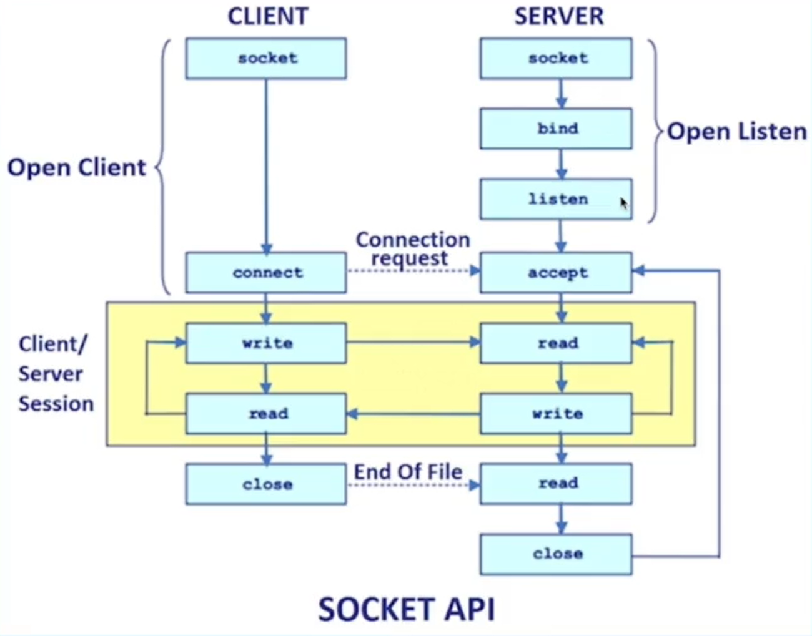

[TOC]


`ctrl` + `/`打开专注模式





### HTTp 框架


#### 超文本传输协议

- 请求行/状态行
    - 方法名
    - URL
    - 协议版本
- **请求头**/响应头
- 请求体/响应体

```
POST /sis HTTP/1.1
Who: Alex 
Content-Type: text/plain 
Host: 127.0.0.1:8888
Content-Length: 28
Let's watch a movie together
```


#### 问题与展望

- HTTP1 队头阻塞, 传输效率低, 明文传输不安全  (头部太大)
- HTTP2 多路复用, 头部压缩, 二进制协议
- QUIC 基于 **UDP** 实现, 解决队头阻塞加, 密减少握手次数, 支持快速启动


#### 盖尔定律

一个切实可行的复杂系统势必是从一个切实可行的**简单系统**发展而来的。从头开始设计的复杂系统根本不切实可行，无法修修补补让它切实可行。你必须由一个切实可行的简单系统重新开始。


先 `run`起来, 再考虑复用, 使用**迭代**的方式进行


#### 合理的 API

不要试图在文档中说明,很多用户不看文档, 这也是在说: **代码的自注释性**

- 可理解性:如ctx.Body(),ctx.GetBody(),不要用ctx. BodyA()
- 简单性:如`ctx.Request. Header.Peek(key)`
    /ctx. GetHeader(key)
- 冗余性
- 兼容性
- 可测性
- 可见性


#### 什么是框架和中间件

在计算机编程和软件开发中，框架中间件（Framework Middleware）是指位于**应用程序和底层框架**之间的软件组件或功能模块。它提供了一种可插拔的方式，用于增强、定制或修改框架的行为，以满足特定的需求。

框架中间件在应用程序和底层框架之间充当了一个抽象层，用于处理和转换请求、响应以及其他相关的操作。它可以介入整个请求 - 响应周期，对数据进行预处理、后处理或者执行其他的附加操作。

框架中间件的主要作用有：

1. 路由和请求处理：中间件可以通过路由机制将请求分发给不同的处理程序，并执行相应的操作。它可以处理 URL 解析、参数提取、权限验证等任务。
2. 数据转换和格式化：中间件可以对请求和响应的数据进行转换、验证和格式化。例如，可以将请求数据解析为特定的格式（如 JSON、XML），或者将响应数据转换为适合客户端的格式。
3. 认证和授权：中间件可以处理用户身份认证和访问控制的任务。例如，它可以检查用户凭据、验证权限，决定是否允许用户继续执行操作。
4. 缓存和性能优化：中间件可以在请求到达框架之前或之后，进行数据缓存、结果缓存以及其他的性能优化操作。它可以减少对底层资源的访问，提高应用程序的响应速度和性能。
5. 日志记录和错误处理：中间件可以记录应用程序的运行日志，并处理异常情况和错误。它可以捕获和处理异常，记录错误信息，使得问题排查和故障修复更加方便有效。

框架中间件的设计目标是提供灵活性和可扩展性，以满足不同应用程序的需求。通过使用框架中间件，开发人员可以以模块化的方式定制和增强框架的功能，使得应用程序的开发和维护更加容易和高效。


#### 洋葱模型


适用场景:

- 日志记录
- 性能统计
- 安全控制
- 事务处理
- 异常处理


#### 什么是 Handler

在计算机编程和软件开发中，Handler（处理器）是指用于处理特定事件或请求的代码块、函数或对象。它充当了一个中间人，接收来自外部系统或其它组件的事件或请求，并对其进行适当的处理和响应。

Handler 的主要任务是根据接收到的事件或请求的类型，执行相应的逻辑。它可以包括各种操作，如数据处理、错误处理、用户界面更新、网络通信、数据库查询等。

Handler 可以存在于不同的上下文中。例如，对于图形用户界面（GUI），一个按钮点击事件的处理者就是一个 Handler；在服务端开发中，一个 HTTP 请求的处理者也可以被称为 Handler。它们根据特定的事件或请求类型，执行相应的操作以满足需求。

在许多框架和库中，一般会有一套明确定义的规则和接口来定义和使用 Handler。这些规则和接口可以使开发人员更方便地定义和注册 Handler，并将其与相应的事件或请求关联起来。

总之，Handler 是用于处理特定事件或请求的代码块、函数或对象，它负责执行相关的逻辑以满足需求。通过合理的使用和组织 Handler，可以有效地管理和处理系统中的各种事件和请求。


框架路由实际上就是为URL匹配对应的处理函数(Handlers)

- 静态路由:/a/b/c./a/b/d
- 参数路 :/a/:id/c(/a/b/c,/a/d/c)./*all
- 路由修复: 
    - 如果只注册了 /a/b，但是访问的 URI 是 /a/b/，那可以提供自动重定向到 /a/b 能力；同样，如果只注册了 /a/b/，但是访问的 URI 是 /a/b，那可以提供自动重定向到 /a/b/ 能力

- 冲突路由以及优先级
    - 同时注册 /a/b 和 /:id/b，并设定优先级。比如：当请求 URI 为 /a/b 时，优先匹配静态路由 /a/b

- 匹配HTTP方法
- 多处理函数:方便添加中间件


如何匹配HTTP方法


#### 开发流程

- 1.明确需求:考虑清楚要解决什么问题,有哪些需求
- 2.业界调研:业界都有哪些解决方案可供参考
- 3.方案权衡:思考不同方案的取舍
- 4.方案评审:相关同学对不同方案做评审
- 5.确定开发:确定最合适的方案进行开发


```go
type Server interface{
	Serve(c context. Context, conn network.Conn) error
}


type Conn interface {
    Read(b []byte)(n int, err error)
    Write(b []byte)(n int, err error)
}
```


[字节内部网络模型](https://github.com/cloudwego/netpoll)


#### 总结

- API设计:可理解性、简单性
- 中间件设计: 洋葱模型
- 路由设计:前缀匹配树
- 协议层设计:抽象出合适的接口
- 网络层设计: 网络模型


#### 设计点

- 存下全部Header
- 减少系统调用次数
- 能够复用内存
- 能够多次读


```go
type Reader interface {
    // 开始读的位置
    Peek(n int)([]byte, error)
    Discard(n int)(discarded int, err error)
    Release() error 
    Size() int 
    Read(b []byte)(l int, err error)
}
```


#### 网络库比较

- `go net `  流式友好, 小包性能高
- `netpoll` 中大包性能高, 时延低


#### 针对协议的优化

- 找到Header Line边界:`\r\n`, 先找到`\n`再看它前一个是不是`\r`
- 热点资源**池化**


针对协议相关的Headers

- 1.通过 Header key 首字母快速筛除掉完全**不可能**的 key
- 2.解析对应 value到独立字段
- 3.使用 byte slice 管理对应 header 存储,方便复用请求体中同样处理的Key:
    User-Agent、 Content-Type、 Content-Length、 Connection、 Transfer-Encoding


[开源 json 库](https:/github.com/bytedance/sonic)


#### SIMD技术


SIMD（Single Instruction, Multiple Data）是一种**并行计算**的技术，它在同一时间执行相同的指令来处理多个数据元素。它是在计算机体系结构中用于向量化操作的一种方式。

传统的计算机指令集架构（ISA）以标量方式执行指令，即每次执行一个指令处理一个数据元素。而 SIMD 架构通过引入特殊的寄存器和指令集，能够同时处理多个数据元素，加速并行计算。

SIMD 技术适用于那些可以**被划分为多个独立任务**的数据，并且这些任务可以并行地进行相同的计算。它可以提高多媒体处理、图形渲染、信号处理、科学计算等应用的性能。

SIMD 指令集提供了一系列的指令，用于在单个时钟周期内同时对多个数据进行相同的操作。这些指令可以一次性处理多个数据元素，例如同时对四个浮点数执行加法操作。

常见的 SIMD 指令集包括 Intel 的 SSE（Streaming SIMD Extensions）、AMD 的 3DNow!、ARM 的 NEON 等。这些指令集通常有不同的版本，支持不同的宽度（如 128 位、256 位）和数据类型（如整数、浮点数）。

使用 SIMD 技术可以显著提高计算性能，但需要合理的程序设计和优化以充分利用 SIMD 指令集的并行计算能力。许多编程语言和编译器提供了对 SIMD 的支持，使得开发者能够方便地利用 SIMD 技术来加速计算。


#### 性能不是全部

- 追求性
- 追求易用, 减少误用
- 打通内部生态
- 文档建设、用户群建设, 


#### websocket

我们知道 TCP 连接的两端，**同一时间里**，**双方**都可以**主动**向对方发送数据。这就是所谓的**全双工**。而现在使用最广泛的 `HTTP/1.1`，也是基于 TCP 协议的，**同一时间里**，客户端和服务器**只能有一方主动**发数据，这就是所谓的**半双工**。

这是由于 HTTP 协议设计之初，考虑的是看看网页文本的场景，能做到**客户端发起请求再由服务器响应**，就够了，根本就没考虑网页游戏这种，客户端和服务器之间都要互相主动发大量数据的场景。

所以，为了更好的支持这样的场景，我们需要另外一个**基于 TCP 的新协议**。

于是新的应用层协议 **WebSocket** 就被设计出来了。


我们平时刷网页，一般都是在浏览器上刷的，一会刷刷图文，这时候用的是 **HTTP 协议**，一会打开网页游戏，这时候就得切换成我们新介绍的 **WebSocket 协议**。

为了兼容这些使用场景。浏览器在 **TCP 三次握手**建立连接之后，都**统一使用 HTTP 协议**先进行一次通信。

- 如果此时是**普通的 HTTP 请求**，那后续双方就还是老样子继续用普通 HTTP 协议进行交互，这点没啥疑问。
- 如果这时候是**想建立 WebSocket 连接**，就会在 HTTP 请求里带上一些**特殊的 header 头**，如下：

```http
Connection: Upgrade
Upgrade: WebSocket
Sec-WebSocket-Key: T2a6wZlAwhgQNqruZ2YUyg==\r\n
```

这些 header 头的意思是，浏览器想**升级协议（Connection: Upgrade）**，并且**想升级成 WebSocket 协议（Upgrade: WebSocket）**。同时带上一段**随机生成的 base64 码（Sec-WebSocket-Key）**，发给服务器。

如果服务器正好支持升级成 WebSocket 协议。就会走 WebSocket 握手流程，同时根据客户端生成的 base64 码，用某个**公开的**算法变成另一段字符串，放在 HTTP 响应的 `Sec-WebSocket-Accept` 头里，同时带上 `101状态码`，发回给浏览器。HTTP 的响应如下：

```http
HTTP/1.1 101 Switching Protocols\r\n
Sec-WebSocket-Accept: iBJKv/ALIW2DobfoA4dmr3JHBCY=\r\n
Upgrade: WebSocket\r\n
Connection: Upgrade\r\n
```


### RPC框架

#### 什么是 RPC

RPC（Remote Procedure Call）是一种用于实现**分布式**系统通信的协议和机制。它允许一个进程（客户端）调用另一个运行在不同地址空间的进程（服务器）中的函数或方法，就像调用本地函数一样。

RPC 的工作原理如下：

1. 客户端通过本地调用的方式调用远程服务器的函数或方法。
2. 客户端的 RPC stub（存根）将调用信息打包成网络可传输的消息，并发送给远程服务器。
3. 服务器的 RPC stub 接收到消息后，解包调用信息并调用对应的函数或方法。
4. 函数或方法执行完毕后，将结果打包成响应消息，并发送给客户端。
5. 客户端的 RPC stub 接收到响应消息后，解包结果并返回给本地调用方。

通过 RPC，开发人员可以轻松地在分布式系统中调用远程服务，而无需关心底层的网络通信细节。它隐藏了网络通信的复杂性，使得分布式系统开发更加方便和高效。

RPC 的优势包括：

1. 简化分布式系统开发：RPC 提供了一种简单而直观的方法来调用远程服务，使得分布式系统开发更加容易和高效。
2. 高效的网络通信：RPC 可以使用高效的序列化和网络传输协议，以最小的开销在分布式系统间传递数据。
3. 抽象底层细节：RPC 抽象了底层的网络通信细节，使得开发人员可以更专注于业务逻辑的实现，而不用关心底层通信协议和传输细节。

常见的 RPC 框架包括 gRPC、Apache Thrift、Spring Cloud、Dubbo 等。这些框架提供了丰富的功能和工具，使得分布式系统的开发、部署和管理更加便捷和可靠。


和 `HTTP` 对比起来

- HTTP 信息非常的冗余, 
- 而 RPC，因为它定制化程度更高，因此性能也会更好一些，这也是在公司**内部微服务**中抛弃 HTTP，选择使用 RPC 的最主要原因。
- 当然上面说的 HTTP，其实**特指的是现在主流使用的 HTTP/1.1**，`HTTP/2` 在前者的基础上做了很多改进，所以**性能可能比很多 RPC 协议还要好**，甚至连 `gRPC` 底层都直接用的 `HTTP/2`。那么问题又来了，为什么既然有了 HTTP/2，还要有 RPC 协议？这个是由于 HTTP/2 是 2015 年出来的。那时候很多公司内部的 RPC 协议都已经跑了好些年了，基于**历史原因**，一般也没必要去换了


RPC需要解决的问题

- 1 函数**映射**
- 2.数据**转换**成字节流
- 3.网络传输


RPC 的概念模型：

- User、
- User-Stub、
- RPC-Runtime、
- Server-Stub、
- Server


#### 优缺点

优点

- 单一职责,有利于分工协作和运维开发
- 可扩展性强, 资源使用率更优
- 故障隔离, 服务的整体可靠性更高


坏处

- 1.服务宕机,对方应该如何处理?
- 2.在调用过程中发生网络异常,如何保证消息的可达性?
- 3.请求量突增导致服务无法及时处理, 有哪些应对措施?


#### 分层设计

- 编解码层 包括生成代码
- 协议层
- 网络层


- 语言特定的格式
    - 许多编程语言都内建了将内存对象编码为字节序列的支持,例如Java有java.io.Serializable
- 文本格式JSON、XML、CSV等文本格式,具有人类可读性
- 二进制编码, 具备跨语言和高性能等优点,常见有Thrift的 BinaryProtocol, Protobuf


TLV编码

- Tag:标签,可以理解为类型
- Lenght:长度
- Value:值,Value也可以是个TLV结构


增加了冗余信息


#### 编码层如何选

- 兼容性, 支持自动增加新的字段,而不影响老的服务,这将提高系统的灵活度
- 通用性支持跨平台、跨语言
- 性能从空间和时间两个维度来考虑,也就是编码后**数据大小**和**编码耗费时长**


### 微服务

微服务架构是当前大多数互联网公司的**标准架构**.


#### 软件架构定义

​     软件架构是构建应用系统所需要的一组结构，包括软件元素、**元素之间的关系**以及两者的属性。其中如何分解软件元素以及这些元素之间的关系，变得非常重要。一个好的软件架构具备两个特点:

- 合理调配生产关系与生产力，让具备不同专业知识与技术栈的的人士都参与到软件系统开发中来， 高效地协同工作；
- 能让各个软件元素有清晰的定义与职责，并有一套良好、高效的交互机制.


为什么系统架构需要演进?

- 互联网的爆炸性发展
- 硬件设施的快速发展
- 需求复杂性的多样化开发人员的急剧增加
- 计算机理论及技术的发展


#### 单体模式

all in one process

优势

- 1.性能最高
- 2冗余小

劣势:

1.debug
2.模块相互影响
3.模块分工、开发流程


#### 分布式架构

抽出业务无关的公共模块, 服务层

优势:
1.业务无关的独立服务

劣势:

- 1.服务模块bug可导致全站瘫痪 
- 2.调用关系复杂
- 3.不同服务冗余


#### 微服务架构


在讲述微服务架构之前一定要讲下经典的扩展立方体理论，扩展立方体定义了三种不同的扩展应用程序的方法：

- X 轴扩展在多个相同实例之间实现请求的负载均衡；
- Y 轴扩展根据功能将应用程序拆分为服务； 
- Z 轴扩展根据请求的属性路由请求.


- X扩展,称为水平复制,通过克隆实例的方式发展
- Y轴扩展,又称为功能性分解,通过不同
- Z轴扩展,又称为数据分区,通过类似客户ID的方式,把相同的数据分区进行扩展


微服务架构其实可以理解为” 模块化设计 "的扩展延伸，只是这些" 功能模块 " 以单独的部署包的方式运行在各自的进程中。这样每个服务之间都是相互独立的，并且有自己的**私有数据库**，两者之间仅能通过 **API** 的方式进行通信。


从单体架构到微服务架构的演进也带来了以下好处:

- 从代码管理来看，每个服务较小，大部分由于十几个接口或服务方法组成，非常容易**维护**；
- 从运维管理来看，每个服务都可以独立部署，非常易于**扩展**； 
- 从团队管理来看，可以更好地划分职责范围；
- 从软件开发总体来看，可以使软件系统可持续性交付部署.


彻底的服务化优势:

- 1.开发效率
- 2.业务独立设计
- 3.自下而上
- 4.故障隔离

劣势:

- 1.治理、运维难度
- 2.观测挑战
- 3.安全性
- 4.分布式系统


微服务架构概览

- 网关
- 服务配置和治理
- 链路追踪和监控


#### 微服务架构的三大要素

- 服务治理（本课程内容）
    - 服务注册
    - 服务发现
    - 负载均衡
    - 扩缩容
    - 流量治理
    - 稳定性治理

- 可观测性
    - 日志采集
    - 日志分析
    - 监控打点
    - 监控大盘
    - 异常报警
    - 链路追踪

- 安全
    - 身份验证
    - 认证授权
    - 访问令牌
    - 审计
    - 传输加密
    - 黑产攻击


服务service 

- 一组具有**相同逻辑** (同一份代码) 的运行实体.

实例与进程的关系

- 实例与进程之间没有必然对应关系,可以一个实例可以对应一个或多个进程(反之不常见).

常见的实例承载形式

-  进程、VM、k8spod…

有状态/无状态服务

- 服务的实例是否存储了可持久化的数据(例如磁盘文件).


服务间通信

- 对于单体服务,不同模块通信只是简单的函数调用
- 对于微服务,服务间通信意味着**网络传输**

使用微服务架构的应用程序是分布式系统，进程间通信是重要组成部分，有以下几种通信模式:

- 通信风格：使用哪一种的进程间通信机制；
- 服务发现：客户端如何获得具体实例的真实 IP 地址；
- 可靠性：在服务不可用的情况下，如何确保服务之间的可靠通信；
- 事务性消息：如何将消息发送、事件发布、更新业务数据的数据库事务集成；
- 外部 API: 应用客户端如何与服务通信.


问题

在代码层面,如何指定调用一个目标服务的地址(ip:port)

- 地址会变
- 有多个地址

使用 DNS 解决

- 本地DNS存在缓存,导致延时.
- 负载均衡问题. 大部分会只访问第一个
- 不支持服务实例的探活检查.
- 域名无法配置端口. 必须约定端口

解决思路:新增一个统一的**服务注册**中心, 用于存储服务名到服务实例的映射.


#### 服务发布

问题

- 服务不可用  
- 服务抖动
- 服务回滚

方法

- 蓝绿部署---简单,稳定但需要两倍资源
- 灰度发布---一点一点替换, 回滚操作比较难


防止链路重试链路层面的防重试风暴的核心是限制每层都发生重试,理想情况下只有最下一层发生重试.
可以返回特殊的status表明"请求失败,但别重试".
