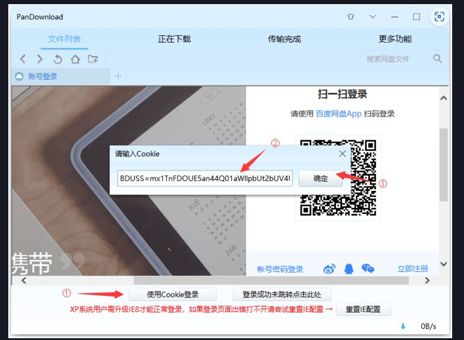

 用来存放我的项目以及一些好的项目


### 1 开源项目推荐


### 2 我的项目

- [设计模式](https://github.com/li54426/Design_patterns_cpp)
- [STL笔记](https://github.com/li54426/STL_Notes)
- [http web server](https://github.com/li54426/tinywebserver)
- [c内存管理]()


#### 3 工具使用

- [Github使用指南](https://li54426.github.io/api_software/2023/github.html)
- [好软推荐](https://github.com/li54426/Best_Softwares)
- [ ChartGPT _web](https://github.com/binjie09/chatgpt-web)
- [1024 code 使用说明](https://li54426.github.io/api_software/2023/1024-code.html)
- [云盘搜索](https://yiso.eu.org/)
- [IDM下载](http://www.qiuquan.cc/download/idm.html)
- [企业版WPS](https://www.daqing.gov.cn/daqing/xgxz/202006/87790/files/WPS_Office_2019_%E5%A4%A7%E5%BA%86%E5%B8%82%E5%85%9A%E6%94%BF%E6%9C%BA%E5%85%B3%E4%B8%93%E7%94%A8%E7%89%88.zip)
- [批量网页转pdf](https://www.aconvert.com/webpage/)


### 3 成文笔记下载

[cpp_quick_book](/assets/cpp1_quick_book.pdf)


#### 福利

```bash
#百度 cookie
BDUSS=nVsMXpIaWI5Mm9ZYVpUR00wWVF1aElVbmxoeXBZb3RoNTVSb1BxT05SRjV6ekJsRVFBQUFBJCQAAAAAAAAAAAEAAACEEZaQeWttNDQ5AAAAAAAAAAAAAAAAAAAAAAAAAAAAAAAAAAAAAAAAAAAAAAAAAAAAAAAAAAAAAAAAAAAAAAAAAAAAAHlCCWV5QgllR; STOKEN=b0bea08f434d4fe02a3f67c906655945d297c05c36ebd200bac5f847d55a62ba
```


